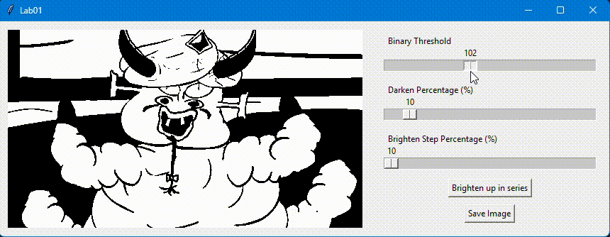
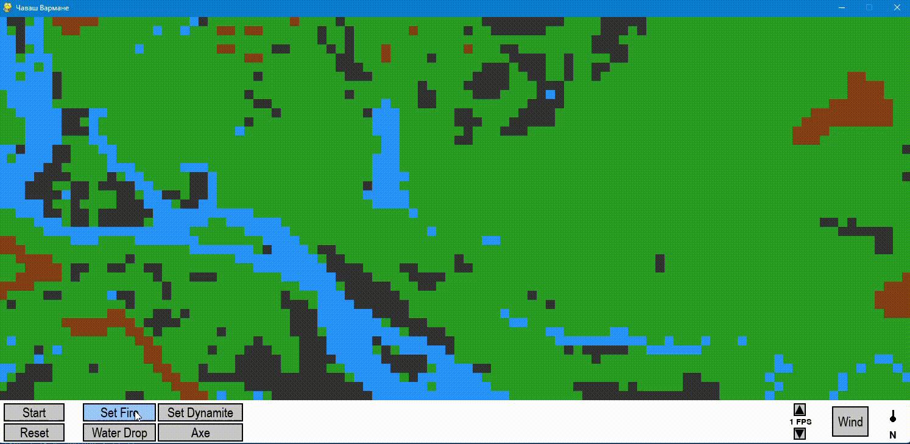

# Discrete Modeling - AGH University

## About the Course  
This repository contains projects developed as part of the **Discrete Modeling** course at **AGH University of Science and Technology**. The course introduces students to computational modeling techniques used for simulating various physical and engineering phenomena.  

The main focus is on **cellular automata**, **lattice gas models**, and **lattice Boltzmann methods (LBM)**. These techniques are widely used in **material science, fluid dynamics, and complex system simulations**.  

## Projects Overview  

Each project is implemented using **Python** or **C++ with CUDA** to leverage GPU acceleration for high-performance simulations.

### 🔹 Image Processing
- **Binarization of an Image** *(Python - `binarization/`)*  
  Converts an image to a binary format using thresholding techniques.  
  <div align="center">
      
  </div>  

### 🔹 Cellular Automata (CA)
- **1D Cellular Automata** *(Python - `contextual and morphological transformations/`)*  
  Generates patterns based on simple one-dimensional automata rules.  
  <div align="center">
      
  </div>  
- **2D Cellular Automata - Conway's Game of Life** *(Python - `CA - Conway's Game of Life/`)*  
  A simulation of John Conway’s famous Game of Life.  
  <div align="center">
      
      
      
  </div>  
- **2D Cellular Automata - Forest Fire Simulation** *(Python - `forest fire/`)*  
  Models the spread of fire in a forest using probabilistic rules.  
  <div align="center">
      
  </div>  

### 🔹 Lattice Gas and Lattice Boltzmann Methods
- **Lattice Gas Automata (LGA) Simulation** *(C++ with CUDA - `LGA/`)*  
  Simulates gas flow using cellular automata principles.  
  <div align="center">
      
  </div>  
- **Diffusion Simulation with LBM** *(C++ with CUDA - `LBM/`)*  
  Models diffusion using the Lattice Boltzmann Method.  
  <div align="center">
      
  </div>  
- **Fluid Flow Simulation with LBM** *(C++ with CUDA - `LBM/`)*  
  Simulates fluid flow, capturing complex behaviors like turbulence.  
  <div align="center">
      
  </div>  
- **Boundary Conditions for LBM Simulations** *(C++ with CUDA - `LBM/`)*  
  Implements various boundary conditions for better accuracy.  
  <div align="center">
      
  </div>  
- **Advanced LBM Flow Simulation with Visualization** *(C++ with CUDA - `LBM/`)*  
  Enhances LBM simulations with additional particles, gravity effects, and data export options (CSV, BMP).  
  <div align="center">
      
  </div>  

## Getting Started  
To run the projects:  
1. **Python Projects:** Install dependencies using:  
   ```sh
   pip install -r requirements.txt
